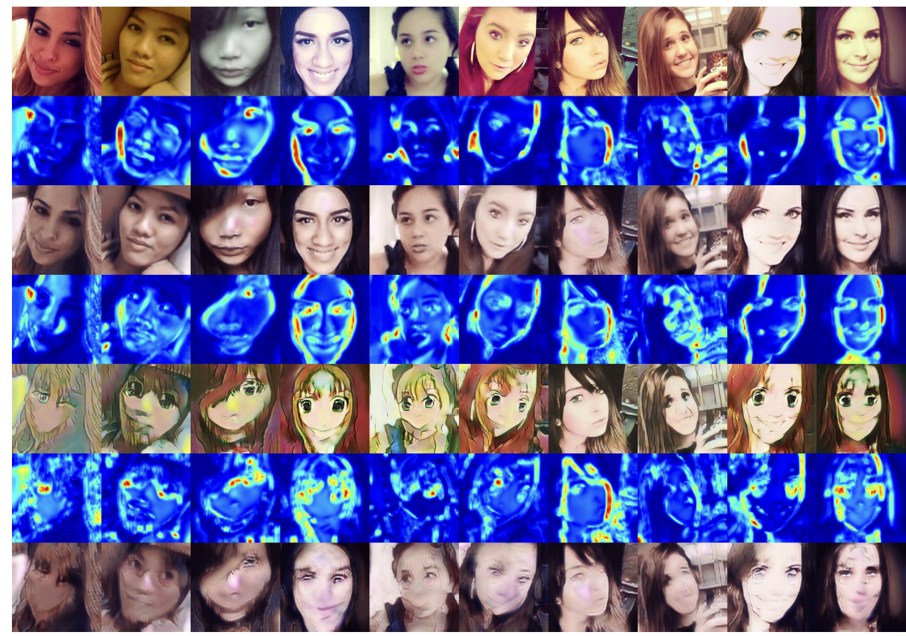
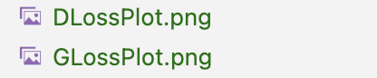
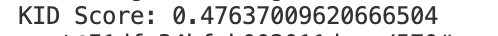
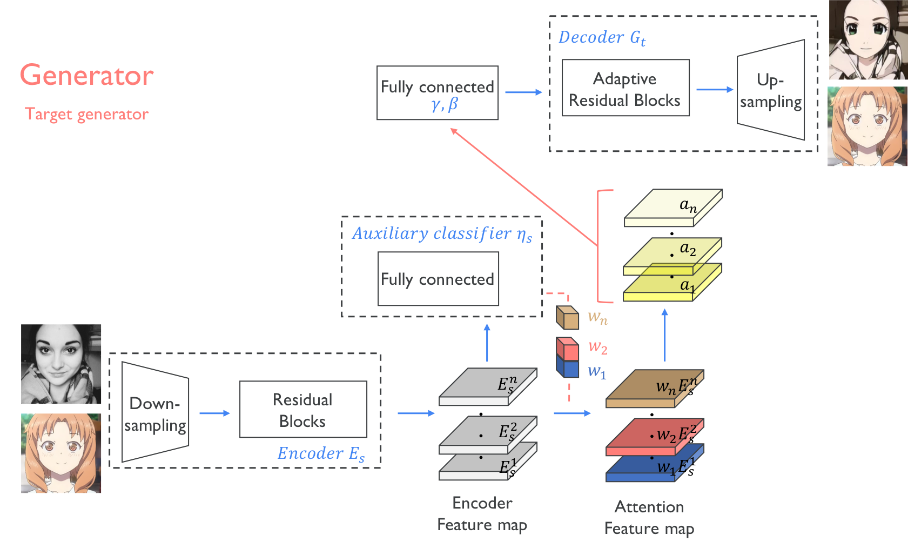

## U-GAT-IT &mdash;  PyTorch Reimplementation
### : Unsupervised Generative Attentional Networks with Adaptive Layer-Instance Normalization for Image-to-Image Translation

<div align="center">
  
</div>


## Usage
```
├── dataset
   └── selfie2anime
       ├── trainA
           ├── xxx.jpg (name, format doesn't matter)
           ├── yyy.png
           └── ...
       ├── trainB
           ├── zzz.jpg
           ├── www.png
           └── ...
       ├── testA
           ├── aaa.jpg 
           ├── bbb.png
           └── ...
       └── testB
           ├── ccc.jpg 
           ├── ddd.png
           └── ...
```


### Dataset
```
https://drive.google.com/file/d/1xOWj1UVgp6NKMT3HbPhBbtq2A4EDkghF/view
```

### Revision
Platform:
Gpushare cloud:GPU-A30

main.py:Due to gpu disk and time constraints.Run 10, 100, 1000, 10000 iterations to analyze the model.

UGATIT.py:Add functions to plot D_losses and G_losses to analyze the model performance.(results in term paper)

test.py:Added functionality to extract specific sections of combined images for KID calculation.

kid.py:Implemented feature extraction, kernel function, and KID computation.

Sample
<div align="center">
  
</div>
<div align="center">
  
</div>


### Train
```
> python main.py --dataset selfie2anime
```

### Test
```
> python main.py --dataset selfie2anime --phase test
```

### Results
```
Due to files limitation,results files can't upload. After running training and testing, results can be created automatically。
```

## Architecture
<div align="center">
  
</div>

---

<div align="center">
  
</div>

