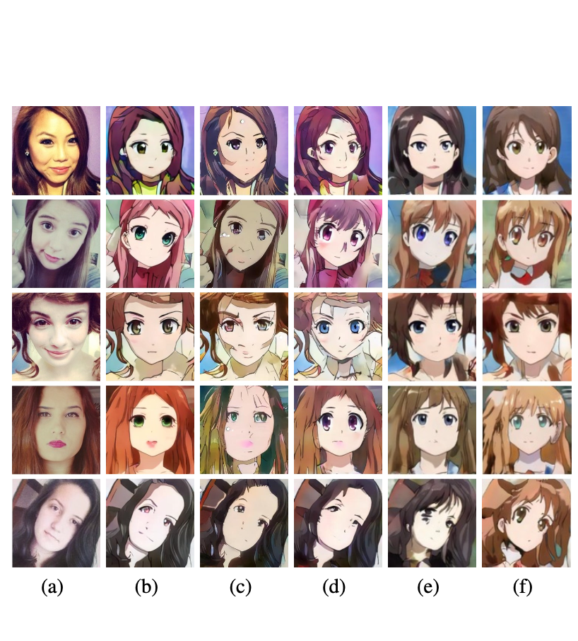

## U-GAT-IT &mdash;  PyTorch Reimplementation
### : Unsupervised Generative Attentional Networks with Adaptive Layer-Instance Normalization for Image-to-Image Translation

<div align="center">
  
</div>


> **U-GAT-IT: Unsupervised Generative Attentional Networks with Adaptive Layer-Instance Normalization for Image-to-Image Translation**<br>
>
> **Abstract** *We propose a novel method for unsupervised image-to-image translation, which incorporates a new attention module and a new learnable normalization function in an end-to-end manner. The attention module guides our model to focus on more important regions distinguishing between source and target domains based on the attention map obtained by the auxiliary classifier. Unlike previous attention-based methods which cannot handle the geometric changes between domains, our model can translate both images requiring holistic changes and images requiring large shape changes. Moreover, our new AdaLIN (Adaptive Layer-Instance Normalization) function helps our attention-guided model to flexibly control the amount of change in shape and texture by learned parameters depending on datasets. Experimental results show the superiority of the proposed method compared to the existing state-of-the-art models with a fixed network architecture and hyper-parameters.*

## Usage
```
├── dataset
   └── selfie2anime
       ├── trainA
           ├── xxx.jpg (name, format doesn't matter)
           ├── yyy.png
           └── ...
       ├── trainB
           ├── zzz.jpg
           ├── www.png
           └── ...
       ├── testA
           ├── aaa.jpg 
           ├── bbb.png
           └── ...
       └── testB
           ├── ccc.jpg 
           ├── ddd.png
           └── ...
```
### Dataset
```
https://drive.google.com/file/d/1xOWj1UVgp6NKMT3HbPhBbtq2A4EDkghF/view
```


### Train
```
> python main.py --dataset selfie2anime
```

### Test
```
> python main.py --dataset selfie2anime --phase test
```

### Results
```
Due to quantity limitation,results files can't upload
```

## Architecture
<div align="center">
  
</div>

---

<div align="center">
  
</div>

