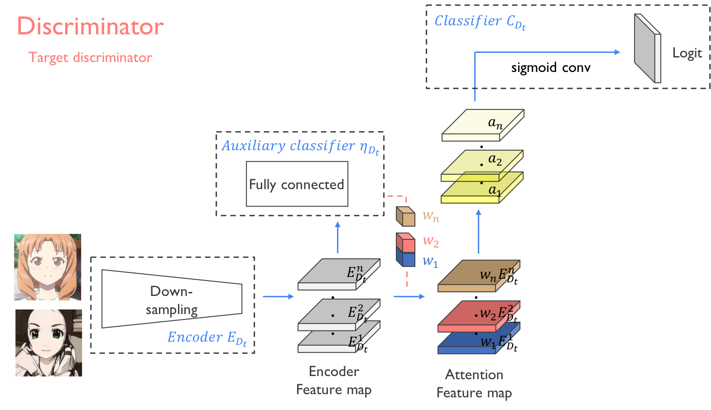

## U-GAT-IT &mdash;  PyTorch Reimplementation
### : Unsupervised Generative Attentional Networks with Adaptive Layer-Instance Normalization for Image-to-Image Translation

<div align="center">
  
</div>


> **U-GAT-IT: Unsupervised Generative Attentional Networks with Adaptive Layer-Instance Normalization for Image-to-Image Translation**<br>
>
> **Abstract** *The paper presents a novel approach to unsupervised image-to-image translation, introducing an enhanced attention module and a learnable normalization function called Adaptive Layer-Instance Normalization (AdaLIN). The attentionmodule enables a more targeted focus on critical regions, effectively distinguishing between source and target domains
using an attention map generated by an auxiliary classifier to direct the algorithm toward the most important areas. Unlike previous methods, the attention module precisely guides the
model to focus on features that differentiate the source fromthe target, while AdaLIN dynamically balances instance and layer normalization to manage shape and texture transformations.  *

## Usage
```
├── dataset
   └── selfie2anime
       ├── trainA
           ├── xxx.jpg (name, format doesn't matter)
           ├── yyy.png
           └── ...
       ├── trainB
           ├── zzz.jpg
           ├── www.png
           └── ...
       ├── testA
           ├── aaa.jpg 
           ├── bbb.png
           └── ...
       └── testB
           ├── ccc.jpg 
           ├── ddd.png
           └── ...
```

### Platform
```
Gpushare cloud:GPU-A30
```
### Dataset
```
https://drive.google.com/file/d/1xOWj1UVgp6NKMT3HbPhBbtq2A4EDkghF/view
```

### Revision
```
main.py:Due to gpu disk and time constraints.Run 10, 100, 1000, 10000 iterations to analyze the model.
UGATIT.py:Add functions to plot D_losses and G_losses to analyze the model performance.(results in term paper)
test.py:Added functionality to extract specific sections of combined images for KID calculation.
kid.py:Implemented feature extraction, kernel function, and KID computation.
Eg.
<div align="center">
  
</div>
<div align="center">
  
</div>
```

### Train
```
> python main.py --dataset selfie2anime
```

### Test
```
> python main.py --dataset selfie2anime --phase test
```

### Results
```
Due to files limitation,results files can't upload. After running training and testing, results can be created automatically。
```

## Architecture
<div align="center">
  
</div>

---

<div align="center">
  
</div>

